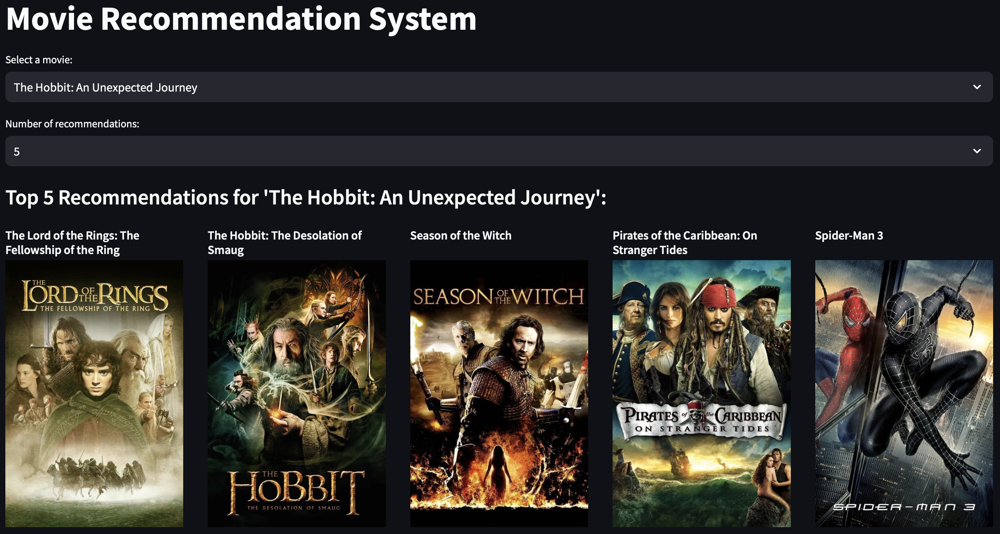

# Movie Recommendations System

This project not only serves as a practical application of my study in Master of Computer & Information Science but also addresses the real-world need for a personalized entertainment experience in the digital age.

The pre-trained cosine similarity object was not committed to this repository due to exceeding GitHub's 100 MB file size constraint. To obtain this object, please run the provided code on your local environment.

# Dataset

- [MovieLens Dataset link](https://www.kaggle.com/datasets/rounakbanik/the-movies-dataset/data)

# How to run?

### Steps:

### STEP 01- clone the repository

```bash
git clone https://github.com/sandarataut/movies_recommendation.git
```

### STEP 02- open the repository

```bash
cd movies_recommendation
```

### STEP 03- check existing conda environment after opening the repository

```bash
conda env list
```

### STEP 04- create and activate a conda environment

```bash
conda create -n movies_recommendation_system python=3.12.8 -y
```

```bash
conda activate movies_recommendation_system
```

### STEP 05- install kernel package and create a new kernel

```bash
conda install ipykernel
```

```bash
python -m ipykernel install --user --name movies_recommendation_system --display-name "movies_recommendation_system"
```

### STEP 06- install the necessary packages / libriaries

```bash
pip install -r requirements.txt
```

### STEP 07- download files from [MovieLens Dataset link](https://www.kaggle.com/datasets/rounakbanik/the-movies-dataset/data) and put those under datasets/origin folder

```bash
movies_metadata.csv
credits.csv
```

### STEP 08- run this files

```bash
01_data_prep.ipynb
02_simple_approaches.ipynb
03_nlp_approaches.ipynb
04_nlp_movie_recommender.ipynb
```

### STEP 09- run the project in localhost

```bash
streamlit run app.py
```

# Demo

- [Website link](https://moviesrecommendation-sandar-at-aut.streamlit.app/)




